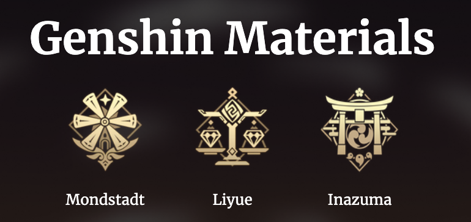
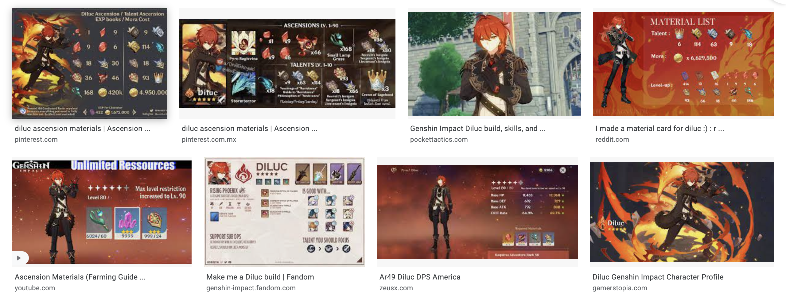

# Genshin Materials 

# Overview
Genshin Impact is an adventure game with a variety of playable characters. In order to strengthen your characters and level them up, they require materials. Genshin Materials is a SPA(Single Page Application) that effectively display the materials and amounts needed for each character. 

This site was formerly an MPA(Multi Page Application) using only HTML/CSS/JS and can be found: [here](https://genshinpages.netlify.app/)

Check out the new Genshin Materials Page Below: 

    <a href="https://genshin-materials.netlify.app/">Live Demo</a>

# Tech Stack 

# Problem 
There are many Genshin information sites out there and they all portray the same or similar information. 

Some only display the materials and not the amount you need.

Some display way too much information and statistics about the character. 

People even create their own pdfs or saveable images of the materials you need like below: 

I simplified these problems in an effective and practical way. 

# Solution
The site is divided into the following two sections: 

The first section, the home page or front page, is for navigating between the characters as well as a concise description of the current charracter displayed. 

The second section, the materials, displays the necessary materials in order to fully max level the character. However, if you do not plan to fully max a character since most players do not, there is a menu specifically for selecting the level you desire. A feature not provided in many other sites. The boss images as well change according to the necessary bosses needed to defeat for the character to level. 

The minimal designs in combination with the interactive menus overall provides for a simple to use application. 